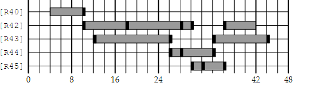

# 寄存器分配

## 任务描述

1. 在本关，你需要在本实验框架中完成线性扫描的寄存器分配算法。你需要补全`src/Backend/RegAlloc.cpp`中的`walk_intervals()`函数。你可以在给定的类中添加你需要的其他方法、成员变量，也可以添加你需要的其他类。实现基础算法无需更改已经给出的实现，但若需要实现自己的算法，任何代码都可以更改。
2. 在实验报告/答辩中，详述你所做的工作。
3. 若对传统的线性扫描算法有更改，也请详述。

## 寄存器分配算法简介

本实验的寄存器分配算法大概分为以下几步：
1. compute_block_order - 将CFG线性化；
2. number_operations - 按照上一步的线性序依次将指令编号(用于后续标明某个值的活跃区间)；
3. build_intervals 为每个要分配寄存器的变量建立interval，即活跃区间的集合；
4. walk_intervals 按照interval的升序遍历所有interval；
5. 在walk_intervals 同时完成寄存器分配或溢出操作。

1-3步的实现已经给出。你需要补全`walk_intervals`函数，完成4、5步。

## 数据结构、接口说明

### Range

```cpp
struct Range{
    Range(int f,int t):from(f),to(t){}
    int from;
    int to;
};
```
表示一个活跃区间。from表示开始，to表示结束。区间左闭右开。下面的代码表示新建一个\[0,4)区间对象。Range的from和to均为非负偶数。

```cpp
auto range = new Range(0, 4);
```

### Interval

```cpp
class Interval{
public:
    explicit Interval(Value* value):val(value){}
    int reg_num = -1;
    Value* val;
    std::list<Range*> range_list;
    std::list<int> position_list;
    void add_range(int from,int to);
    void add_use_pos(int pos);
    bool covers(int id);
    bool covers(Instruction* inst);
    bool intersects(Interval* interval);
    void union_interval(Interval* interval);
};
```
Interval表示一个要分配寄存器的变量的活跃区间（Range）结合。Interval和要分配寄存器的变量是一一对应的。

#### Interval成员变量说明

- `int reg_num`表示给该Interval分配的寄存器号，-1表示溢出到栈上。本实验中你需要为需要分配寄存器的Interval指定分配的寄存器号。每个Interval只能分配一个寄存器号。
- `Value* val`表示该Interval对应的要分配寄存器的变量。
- `std::list<Range*> range_list;`表示该变量的活跃区间列表。列表中range不相交，且按照from从小到大排序。
- `std::list<int> position_list;`表示该变量被引用的位置列表。

#### Interval接口说明

- `void add_range(int from,int to);` 向range_list头加一个新Range。本实验中无需用到该接口，该接口只在build_interval中用到。

- `void add_use_pos(int pos);` 向position_list前加入pos。本实验中无需用到该接口，该接口只在build_interval中用到。

- `bool covers(int id);` 判断该Interval是否覆盖id代表的位置。

- `bool covers(Instruction* inst);` 判断该Interval是否覆盖指令inst。

- `bool intersects(Interval* interval);`判断该Interval和另一个interval是否有相交。

- `void union_interval(Interval* interval);`将另一个interval和该interval合并。

### all_reg_id

`const std::vector<int> all_reg_id = {0,1,2,3,4,5,6,7,8,9,10,12};`表示可用的寄存器号。

### RegAlloc

RegAlloc类即寄存器分配的类。本部分只介绍其中可能用到的接口或成员变量。

#### unused_reg_id

未使用的寄存器号。**你在实现寄存器分配算法时要维护好这个数据结构**。

#### remained_all_reg_id

当前可用的寄存器。

#### current

walk_intervals 时当前访问的interval。

#### func

类型为Funcion* 。表示在为该函数进行寄存器分配。该Function的含义与上个IR实验相同。

## 几点说明

1. 每个值的位置应当是固定的。即不存在一会在寄存器，一会在栈上的情况。
2. 你可以添加任意函数、成员变量或类来辅助你完成本实验，若需要添加其他Pass，也可以更改main函数。但不要更改其他已给出的实现。
3. 在最传统的线性扫描寄存器分配算法中，每个Interval只需考虑最开始和最末尾的位置（一个大活跃区间，只考虑活跃区间的最开始和最末尾）。本实验中给出了Interval中的range_list。range_list里的每个range互不相交，按range开始位置升序排列(相当于是本实验中Interval内可能是带“孔洞的”)。下图表示了几个值的活跃区间。
   
   
   对于R43来说，其Interval中的range_list是\[12,28), \[34,46)。传统的线性扫描算法对于R43只考虑\[12,46)即可。你在完成实验时可以利用这些信息，对传统的线性扫描寄存器分配算法进行改进。
5. 传统的寄存器分配算法溢出策略是溢出距当前程序点最远的。这种策略忽略了变量使用情况、循环信息等。你也可以更改传统的线性扫描中的溢出策略。（提示：代价估算）
6. 此时使用的CFG是SSA形式的。
